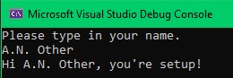

### This project is to help you prepare your environment for an interview with Prospa.
### Please follow the steps below to get it working.

### Open the setup.sln file on your preferred IDE and try to execute it.
### Type in your name and check if the app will confirm you are set up, just like the image below.

## Requirements
### To be able to run this app, the only requirement is to have .Net 5.0 installed.
### If you don't have it, please download and install it from this [link](https://dotnet.microsoft.com/download).